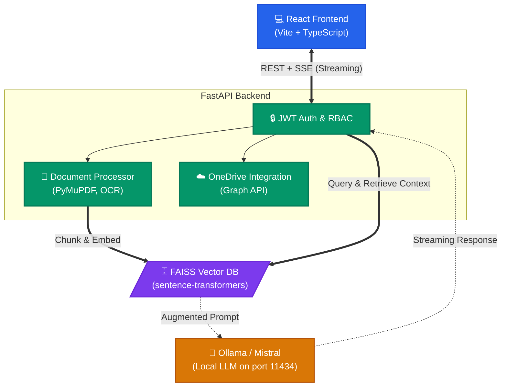

<div align="center">
  <h1>🏦 BankIQ — Role-Based Document-Aware Chatbot</h1>
  <p><i>A production-ready, secure banking chatbot with role-based access control, multi-format document processing, GPU-accelerated embeddings, and a local LLM via Ollama.</i></p>
  
  <p>
    
    
    
    
    
  </p>
</div>

---

## 📑 Table of Contents

- [Overview](#-overview)
- [System Architecture](#-system-architecture)
- [Key Features](#-key-features)
- [Role Permissions Matrix](#-role-permissions-matrix)
- [Prerequisites](#-prerequisites)
- [Quick Start](#-quick-start)
  - [Docker (Recommended)](#docker-recommended)
  - [Local Development](#local-development)
- [Demo Accounts](#-demo-accounts)
- [Folder Structure](#-folder-structure)
- [System Pipelines](#-system-pipelines)
  - [Document Processing](#document-processing-pipeline)
  - [Chatbot Execution](#chatbot-pipeline)
- [OneDrive Integration](#-onedrive-integration)
- [Production Hardening Checklist](#-production-hardening-checklist)

---

## 📖 Overview

**BankIQ** is designed for secure, on-premise document interactions within banking environments. It processes various document formats (PDF, DOCX, PPTX, XLSX, Images), embeds them into a local FAISS Vector database, and uses a local Mistral LLM (via Ollama) to answer user queries with precise context—ensuring sensitive financial data never leaves your infrastructure. 

---

## 🏛️ System Architecture



---

## ✨ Key Features

- **Total Privacy:** Fully local processing with Ollama and local vector embeddings. No data is sent to external APIs like OpenAI.
- **Role-Based Access Control (RBAC):** Strict isolation between Admin, TeamLead, and User capabilities.
- **Multi-Modal Document Parsing:** Supports PDF, Office formats, and OCR for images using PyMuPDF and Tesseract.
- **Streaming Responses:** Real-time token streaming via Server-Sent Events (SSE) for a responsive chat UI.
- **OneDrive Integration:** Built-in adapter for importing documents from Microsoft OneDrive (includes a mock mode for easy testing).

---

## 🔐 Role Permissions Matrix

| Feature                  | Admin (👑) | TeamLead (👥) | User (👤) |
|--------------------------|:---------:|:------------:|:-------:|
| Ask chatbot              |  ✅       |    ✅        |  ✅     |
| View documents           |  ✅       |    ✅        |  ✅     |
| Upload documents         |  ✅       |    ❌        |  ❌     |
| Delete documents         |  ✅       |    ❌        |  ❌     |
| Reprocess documents      |  ✅       |    ✅        |  ❌     |
| Browse OneDrive          |  ✅       |    ✅        |  ❌     |
| Import from OneDrive     |  ✅       |    ✅        |  ❌     |
| Manage users             |  ✅       |    ❌        |  ❌     |
| Vector DB stats & reset  |  ✅       |    ❌        |  ❌     |

---

## 🛠️ Prerequisites

| Dependency      | Version  | Notes                                    |
|-----------------|----------|------------------------------------------|
| **Python**      | 3.11+    | Core backend runtime.                    |
| **Node.js**     | 20+      | Required for frontend build.             |
| **Tesseract**   | 5.x      | `brew install tesseract` / `apt install tesseract-ocr` |
| **Ollama**      | Latest   | Download from [ollama.ai](https://ollama.ai) |
| **CUDA Toolkit**| 11.8+    | *(Optional)* Required for GPU embeddings |

---

## 🚀 Quick Start

### Docker (Recommended)

The easiest way to run the entire stack is via Docker Compose:

```bash
cd banking-chatbot

# Start all services and build images
docker compose up --build
```
> **Note:** On the first run, the Mistral model is pulled automatically. This may take a few minutes depending on your internet connection.

**Services available at:**
- 🌐 **Frontend:** `http://localhost:5173`
- ⚙️ **Backend API:** `http://localhost:8000`
- 🧠 **Ollama:** `http://localhost:11434`
- 📚 **API Docs (Swagger):** `http://localhost:8000/docs`

### Local Development

If you prefer to run services individually without Docker:

**1. Start Ollama and Pull Mistral:**
```bash
ollama pull mistral
ollama serve   # Runs in background
```

**2. Start the Backend:**
```bash
cd banking-chatbot/backend
python -m venv venv
source venv/bin/activate        # Windows: venv\Scripts\activate

# Install requirements
pip install -r requirements.txt

# Start FastAPI server
cp .env.example .env
uvicorn main:app --reload --host 0.0.0.0 --port 8000
```

**3. Start the Frontend:**
```bash
cd ../frontend
npm install
npm run dev
```
Open `http://localhost:5173` in your browser.

---

## 👥 Demo Accounts

Use these predefined accounts to test different permission levels out-of-the-box:

| Username | Password    | Role     |
|----------|-------------|----------|
| `admin`  | `admin123`  | Admin    |
| `lead`   | `lead123`   | TeamLead |
| `analyst`| `analyst123`| User     |

---

## 📁 Folder Structure

```text
banking-chatbot/
├── backend/                             # Python FastAPI application
│   ├── main.py                          # App entry point
│   ├── requirements.txt
│   ├── Dockerfile
│   └── app/
│       ├── api/                         # REST Endpoints (auth, chat, admin)
│       ├── core/                        # Config, security, DB management
│       ├── models/                      # Data models and Enums
│       └── services/                    # LLM, OCR, and integrations
├── frontend/                            # React + Vite application
│   ├── package.json
│   ├── vite.config.ts
│   └── src/
│       ├── components/                  # React UI components
│       ├── store/                       # State management (Context)
│       └── utils/                       # API clients and helpers
├── mock_onedrive/                       # Drop files here for mock OneDrive testing
├── uploads/                             # Auto-created: locally uploaded files
├── faiss_index/                         # Auto-created: persisted vector DB index
└── docker-compose.yml                   # Container orchestration
```

---

## 🔄 System Pipelines

### Document Processing Pipeline
1. **Input:** File is received via Upload or OneDrive Import.
2. **Detection & Extraction:** 
   - *PDF:* PyMuPDF → Tesseract OCR (if sparse)
   - *DOCX / PPTX / XLSX:* Native python libraries
   - *Images:* Tesseract OCR
3. **Chunking:** Text is cleaned and split into overlapping chunks (e.g., 512 chars with 64 overlap).
4. **Embedding:** `sentence-transformers` generates vector representations (utilizing GPU if available).
5. **Storage:** Vectors are L2-normalized and persisted to disk via FAISS (`IndexFlatIP`).

### Chatbot Pipeline
1. **Query:** User submits a prompt.
2. **Context Retrieval:** Question is embedded and searched against the FAISS index to fetch Top-K chunks.
3. **Prompt Assembly:** Combines a strict banking system prompt, retrieved chunks, and the user's question.
4. **Generation:** Dispatched to local Mistral LLM via Ollama.
5. **Streaming:** Tokens stream back to the UI in real-time via Server-Sent Events (SSE).

---

## ☁️ OneDrive Integration

### Mock Mode (Default)
Easily test the UI without cloud setup. Just drop supported documents into the `mock_onedrive/` directory in the root. By default, `USE_MOCK_ONEDRIVE=true`.

### Real Microsoft Graph API
To connect to a real corporate OneDrive:
1. Register an application in **Azure Active Directory**.
2. Grant `Files.Read.All` application permission.
3. Update `.env` in the backend:
   ```env
   USE_MOCK_ONEDRIVE=false
   ONEDRIVE_CLIENT_ID=<your-app-client-id>
   ONEDRIVE_CLIENT_SECRET=<your-client-secret>
   ONEDRIVE_TENANT_ID=<your-tenant-id>
   ```

---

## 🛡️ Production Hardening Checklist

Before deploying this to a live banking environment, ensure the following steps are addressed:

- [ ] **Database Migration:** Replace in-memory stores with PostgreSQL (via SQLAlchemy).
- [ ] **Token Management:** Implement Redis for strict token blacklisting upon user logout.
- [ ] **Hardware Acceleration:** Ensure `faiss-gpu` is correctly installed on GPU-enabled nodes.
- [ ] **Rate Limiting:** Protect APIs against abuse (e.g., using `slowapi`).
- [ ] **Audit Logging:** Implement comprehensive audit trails for every RBAC action.
- [ ] **Network Security:** Serve behind a reverse proxy (Nginx/Caddy) with TLS termination.
- [ ] **Secret Management:** Move `.env` configurations to a secure vault (AWS Secrets Manager / Azure Key Vault).
- [ ] **Advanced Access Control:** Implement document-level visibility filters.
- [ ] **Threat Mitigation:** Add ClamAV virus scanning for all uploaded files.
- [ ] **LLM Security:** Lock down the Ollama endpoint behind an authenticated reverse proxy.

---

## 🙏 Acknowledgments & Credits

This project was developed as a solution to a real-world problem statement provided by the **MUFG (Mitsubishi UFJ Financial Group)** team. 

Special thanks to **TNS India Foundation** for their invaluable support. We successfully completed our AI/ML course through their foundation, which was generously funded by **MUFG**. This project stands as a testament to the knowledge and opportunities gained through this collaborative initiative.

---
<div align="center">
  <i>Built with ❤️ for secure and intelligent banking operations.</i>
</div>
